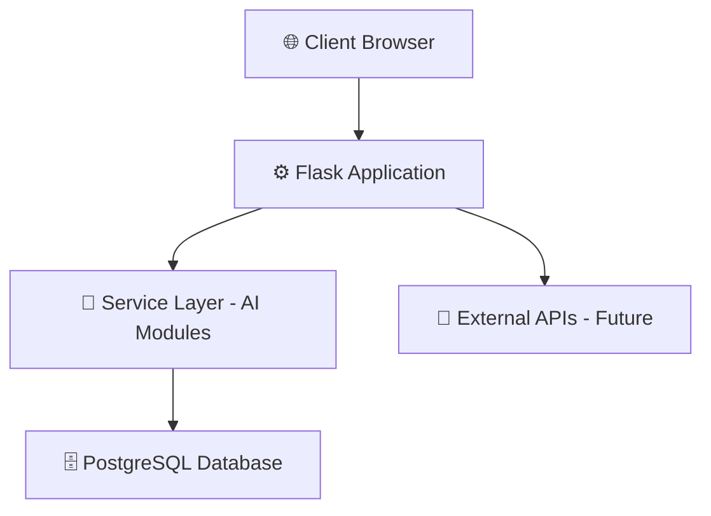
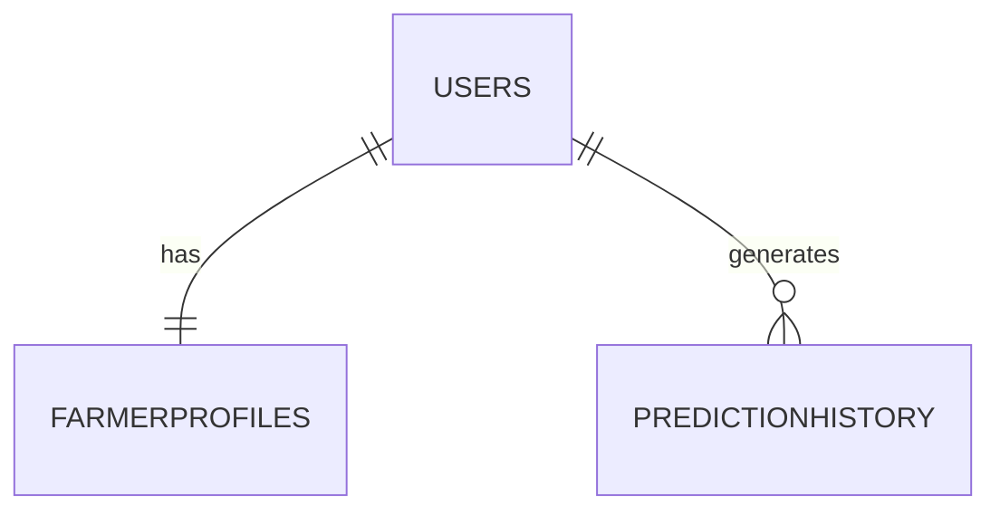
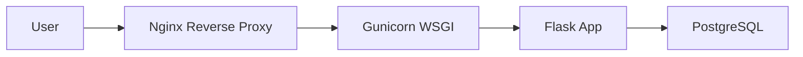

# 🌾🚀 Fasal360  
## 🏗 System Design Document  

---

<div align="center">


</div>

---

# 🧩 1. System Architecture

Fasal360 follows a **Monolithic MVC-Inspired Architecture** designed for modular AI integration and future scalability.

---

## 🔷 Architecture Flow



---

# 🏛 2. High-Level Architecture

---

## 🌐 2.1 Web Layer (Presentation Layer)

Responsible for handling user interaction.

- Flask Routes
- HTTP GET/POST handling
- Jinja2 Template Rendering
- Input Validation
- Session Management

📂 Located in:
```
/routes/
/templates/
/static/
```

---

## 🧠 2.2 Service Layer (AI Engine)

Located inside:

```
/models/
```

Each module:

- Loads trained model
- Accepts input parameters
- Processes prediction
- Returns structured response

### 🔹 AI Modules

- `crop_model.py`
- `disease_model.py`
- `yield_model.py`
- `chatbot_engine.py`
- `livestock_model.py`
- `supply_chain_model.py`
- `eco_score_model.py`
- `onion_storage_model.py`

---

# 🗄 3. Data Layer Design

## 📦 Database: PostgreSQL

---

## 🧾 3.1 Tables Overview

### 👤 Users

| Field | Type | Description |
|-------|------|------------|
| id | PK | Unique user ID |
| name | String | User name |
| email | String | Login email |
| password_hash | String | Encrypted password |
| created_at | Timestamp | Account creation time |

---

### 🌾 FarmerProfiles

| Field | Type |
|-------|------|
| id (PK) | Integer |
| user_id (FK) | Integer |
| location | String |
| soil_type | String |
| land_size | Float |
| crop_focus | String |

---

### 📊 PredictionHistory

| Field | Type |
|-------|------|
| id (PK) | Integer |
| user_id (FK) | Integer |
| module_name | String |
| input_data | JSON |
| output_result | JSON |
| timestamp | Timestamp |

---

## 🔗 Relationships



- One User → One Farmer Profile  
- One User → Many Predictions  

---

# 🤖 4. AI Module Design

---

## 🌾 4.1 Crop Recommendation

- Algorithm: **Random Forest**
- Input normalization
- Label encoding
- Model serialization via `joblib`

---

## 🍂 4.2 Disease Detection

- Algorithm: **YOLOv8**
- Image preprocessing
- Bounding box detection
- Confidence scoring
- Inference ≤ 5 seconds

---

## 💬 4.3 Chatbot Engine

- Algorithm: **TF-IDF**
- Query vectorization
- Cosine similarity comparison
- Confidence threshold filtering

---

# 🎨 5. Frontend Design

---

## 🖥 5.1 UI Principles

- Dashboard-centric navigation
- Minimal clicks
- High-contrast accessibility colors
- Mobile-first responsive design
- Farmer-friendly interface

---

## 🧩 5.2 Core UI Components

- 🌐 Navbar
- 🌤 Weather Widget
- 🌙 Dark Mode Toggle
- 🌍 Language Toggle
- 🧠 Feature Cards
- 📊 Chart Visualizations
- 🔔 Modal System

---

# 🔐 6. Security Design

Security-first architecture:

- 🔒 Password hashing (bcrypt)
- 🛡 CSRF protection
- 🍪 Secure Flask session management
- 🧼 Input sanitization
- 📁 File upload validation
- 🔐 HTTPS enforcement (Production)

---

# 🚀 7. Deployment Design

---

## 🧪 7.1 Development Environment

- Flask Development Server
- Local PostgreSQL
- Debug Mode Enabled

---

## 🌍 7.2 Production Environment



- Gunicorn WSGI server
- Nginx reverse proxy
- PostgreSQL hosted database
- Environment variable configuration

---

# 📈 8. Scalability Plan

Future-proof upgrade strategy:

- 🔹 Convert monolith → Microservices
- 🔹 Separate AI inference service
- 🔹 Docker containerization
- 🔹 CI/CD pipeline automation
- 🔹 Cloud deployment (AWS / GCP)
- 🔹 Load balancer integration

---

# 📊 9. Logging & Monitoring

Current:

- Python logging module
- Error tracking
- Database audit logs

Future:

- Prometheus monitoring
- Grafana dashboards
- Cloud-based log aggregation

---

# 🔄 10. Future Architecture Evolution

---

## Phase 1 – Monolithic Flask App
Single backend handling all modules.

## Phase 2 – REST API Separation
Frontend and backend decoupling.

## Phase 3 – AI Microservice Layer
Dedicated inference server.

## Phase 4 – Cloud-Native Kubernetes
Containerized scalable deployment.

---

<div align="center">

## 🌱 Fasal360 System Design  
### Intelligent Architecture for Intelligent Agriculture

</div>
