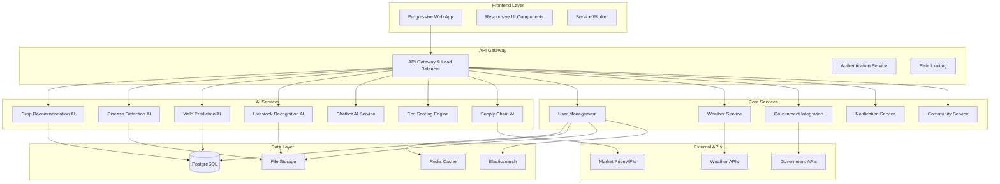

# Design Document: Fasal360 AI-Powered Agriculture Platform

## Overview

Fasal360 is a comprehensive Progressive Web Application (PWA) that leverages artificial intelligence to provide farmers with intelligent agricultural solutions. The platform integrates multiple AI models for crop recommendation, disease detection, yield prediction, and livestock management, while seamlessly connecting with government schemes and providing a rich user experience across devices.

The system follows a microservices architecture with AI services, a central API gateway, and a responsive frontend that works offline. The platform is designed to handle the unique challenges of Indian agriculture, including multilingual support, rural connectivity issues, and integration with government systems.

## Architecture

### High-Level Architecture



### Technology Stack

**Frontend:**
- React 18 with TypeScript for component-based UI
- PWA capabilities with service workers for offline functionality
- Tailwind CSS for responsive design and theming
- React Query for state management and caching
- i18next for internationalization (English/Hindi)

**Backend:**
- Node.js with Express.js for API services
- Python FastAPI for AI model serving
- PostgreSQL for relational data storage
- Redis for caching and session management
- Elasticsearch for search functionality

**AI/ML Stack:**
- TensorFlow/PyTorch for deep learning models
- OpenCV for image processing
- Hugging Face Transformers for NLP
- scikit-learn for traditional ML algorithms

**Infrastructure:**
- Docker containers for microservices
- Kubernetes for orchestration
- NGINX for load balancing and reverse proxy
- AWS S3 for file storage
- CloudFront for CDN

## Components and Interfaces

### AI Engine Components

#### Crop Recommendation Engine
```typescript
interface CropRecommendationRequest {
  soilData: {
    nitrogen: number;
    phosphorus: number;
    potassium: number;
    pH: number;
    organicMatter: number;
  };
  climateData: {
    temperature: number;
    humidity: number;
    rainfall: number;
    season: 'kharif' | 'rabi' | 'zaid';
  };
  location: {
    latitude: number;
    longitude: number;
    state: string;
    district: string;
  };
  farmSize: number;
}

interface CropRecommendation {
  cropName: string;
  suitabilityScore: number;
  expectedYield: number;
  profitabilityIndex: number;
  reasoning: string[];
  soilImprovements?: string[];
  riskFactors: string[];
}
```

#### Disease Detection Engine
```typescript
interface DiseaseDetectionRequest {
  imageData: string; // base64 encoded image
  cropType: string;
  location: GeoLocation;
  symptoms?: string[];
}

interface DiseaseDetectionResult {
  diseaseDetected: boolean;
  diseaseName?: string;
  confidence: number;
  severity: 'low' | 'medium' | 'high';
  treatments: Treatment[];
  preventiveMeasures: string[];
  affectedArea?: number; // percentage of leaf affected
}

interface Treatment {
  type: 'organic' | 'chemical' | 'biological';
  name: string;
  dosage: string;
  applicationMethod: string;
  timing: string;
  cost: number;
}
```

#### Yield Prediction Engine
```typescript
interface YieldPredictionRequest {
  cropType: string;
  plantingDate: Date;
  fieldArea: number;
  soilData: SoilData;
  historicalYield?: number[];
  farmingPractices: {
    irrigationType: 'drip' | 'sprinkler' | 'flood' | 'rainfed';
    fertilizers: FertilizerApplication[];
    pesticides: PesticideApplication[];
    isOrganic: boolean;
  };
  location: GeoLocation;
}

interface YieldPrediction {
  expectedYield: number; // kg per hectare
  confidenceInterval: {
    lower: number;
    upper: number;
  };
  profitEstimate: {
    revenue: number;
    costs: number;
    netProfit: number;
    roi: number;
  };
  riskFactors: RiskFactor[];
  recommendations: string[];
}
```

#### Livestock Recognition Engine
```typescript
interface LivestockRecognitionRequest {
  imageData: string;
  animalType?: 'cattle' | 'buffalo' | 'goat' | 'sheep' | 'poultry';
}

interface LivestockRecognitionResult {
  animals: DetectedAnimal[];
  totalCount: number;
}

interface DetectedAnimal {
  type: 'cow' | 'buffalo' | 'goat' | 'sheep' | 'chicken' | 'duck';
  breed?: string;
  confidence: number;
  boundingBox: {
    x: number;
    y: number;
    width: number;
    height: number;
  };
  healthIndicators?: {
    bodyCondition: number;
    estimatedAge: string;
    visibleIssues: string[];
  };
  careRecommendations: string[];
}
```

### Core Service Components

#### User Management Service
```typescript
interface UserProfile {
  id: string;
  personalInfo: {
    name: string;
    phone: string;
    email?: string;
    language: 'en' | 'hi';
    state: string;
    district: string;
    village: string;
  };
  farmInfo: {
    totalArea: number;
    landType: 'irrigated' | 'rainfed' | 'mixed';
    crops: string[];
    livestock: LivestockInfo[];
    farmingType: 'traditional' | 'organic' | 'mixed';
  };
  preferences: {
    theme: 'light' | 'dark';
    notifications: NotificationPreferences;
    units: 'metric' | 'imperial';
  };
  governmentSchemes: {
    pmKisanId?: string;
    fasalBimaPolicy?: string;
    bankAccount: BankAccountInfo;
  };
}
```

#### Weather Service
```typescript
interface WeatherData {
  current: {
    temperature: number;
    humidity: number;
    windSpeed: number;
    precipitation: number;
    uvIndex: number;
    visibility: number;
  };
  forecast: DailyForecast[];
  alerts: WeatherAlert[];
  agriculturalIndices: {
    soilMoisture: number;
    evapotranspiration: number;
    growingDegreeDays: number;
    chillHours: number;
  };
}

interface WeatherAlert {
  type: 'storm' | 'drought' | 'flood' | 'frost' | 'heatwave';
  severity: 'low' | 'medium' | 'high' | 'extreme';
  startTime: Date;
  endTime: Date;
  description: string;
  farmingAdvice: string[];
}
```

#### Government Integration Service
```typescript
interface GovernmentScheme {
  id: string;
  name: string;
  description: string;
  eligibilityCriteria: EligibilityCriteria;
  benefits: SchemeBenefit[];
  applicationProcess: ApplicationStep[];
  documents: RequiredDocument[];
  deadlines: Date[];
}

interface SchemeApplication {
  schemeId: string;
  userId: string;
  status: 'draft' | 'submitted' | 'under_review' | 'approved' | 'rejected';
  applicationData: Record<string, any>;
  submissionDate: Date;
  lastUpdated: Date;
  statusHistory: StatusUpdate[];
}
```

### Frontend Components

#### Progressive Web App Shell
```typescript
interface PWAConfig {
  caching: {
    staticAssets: string[];
    apiEndpoints: CacheableEndpoint[];
    maxCacheSize: number;
    cacheStrategy: 'cache-first' | 'network-first' | 'stale-while-revalidate';
  };
  offline: {
    fallbackPages: string[];
    offlineIndicator: boolean;
    syncWhenOnline: boolean;
  };
  notifications: {
    vapidKey: string;
    enablePush: boolean;
    notificationTypes: string[];
  };
}
```

#### Responsive UI Components
```typescript
interface ResponsiveBreakpoints {
  mobile: '320px';
  tablet: '768px';
  desktop: '1024px';
  wide: '1440px';
}

interface ThemeConfig {
  light: ColorPalette;
  dark: ColorPalette;
  animations: {
    particles: boolean;
    transitions: 'none' | 'reduced' | 'full';
  };
}
```

## Data Models

### Core Data Entities

#### Farm Data Model
```typescript
interface Farm {
  id: string;
  ownerId: string;
  name: string;
  location: {
    coordinates: [number, number]; // [longitude, latitude]
    address: {
      village: string;
      district: string;
      state: string;
      pincode: string;
    };
    surveyNumber?: string;
  };
  area: {
    total: number;
    cultivable: number;
    irrigated: number;
    unit: 'acre' | 'hectare';
  };
  soilProfile: {
    type: 'clay' | 'loam' | 'sandy' | 'silt' | 'mixed';
    pH: number;
    organicMatter: number;
    nutrients: {
      nitrogen: number;
      phosphorus: number;
      potassium: number;
    };
    lastTested: Date;
  };
  waterSources: WaterSource[];
  infrastructure: FarmInfrastructure;
  certifications: Certification[];
  createdAt: Date;
  updatedAt: Date;
}
```

#### Crop Cycle Data Model
```typescript
interface CropCycle {
  id: string;
  farmId: string;
  cropType: string;
  variety: string;
  season: 'kharif' | 'rabi' | 'zaid';
  plantingDate: Date;
  expectedHarvestDate: Date;
  actualHarvestDate?: Date;
  area: number;
  inputs: {
    seeds: SeedInput[];
    fertilizers: FertilizerInput[];
    pesticides: PesticideInput[];
    irrigation: IrrigationRecord[];
  };
  monitoring: {
    growthStages: GrowthStageRecord[];
    diseaseIncidents: DiseaseIncident[];
    pestAttacks: PestAttack[];
    weatherImpacts: WeatherImpact[];
  };
  harvest: {
    actualYield?: number;
    quality: QualityMetrics;
    marketPrice: number;
    totalRevenue: number;
    totalCosts: number;
    netProfit: number;
  };
  sustainability: {
    waterUsage: number;
    carbonFootprint: number;
    soilHealthImpact: number;
    biodiversityScore: number;
  };
}
```

#### AI Model Data
```typescript
interface AIModelMetadata {
  modelId: string;
  name: string;
  version: string;
  type: 'crop_recommendation' | 'disease_detection' | 'yield_prediction' | 'livestock_recognition';
  accuracy: number;
  trainingData: {
    size: number;
    lastUpdated: Date;
    regions: string[];
    crops: string[];
  };
  performance: {
    averageResponseTime: number;
    throughput: number;
    errorRate: number;
  };
  deployment: {
    status: 'active' | 'inactive' | 'updating';
    instances: number;
    lastDeployed: Date;
  };
}
```

### Database Schema Design

#### PostgreSQL Tables
```sql
-- Users and Authentication
CREATE TABLE users (
    id UUID PRIMARY KEY DEFAULT gen_random_uuid(),
    phone VARCHAR(15) UNIQUE NOT NULL,
    email VARCHAR(255) UNIQUE,
    name VARCHAR(255) NOT NULL,
    language VARCHAR(2) DEFAULT 'en',
    created_at TIMESTAMP DEFAULT NOW(),
    updated_at TIMESTAMP DEFAULT NOW()
);

-- Farm Information
CREATE TABLE farms (
    id UUID PRIMARY KEY DEFAULT gen_random_uuid(),
    owner_id UUID REFERENCES users(id),
    name VARCHAR(255) NOT NULL,
    location POINT NOT NULL,
    address JSONB NOT NULL,
    area JSONB NOT NULL,
    soil_profile JSONB,
    water_sources JSONB[],
    infrastructure JSONB,
    created_at TIMESTAMP DEFAULT NOW(),
    updated_at TIMESTAMP DEFAULT NOW()
);

-- Crop Cycles
CREATE TABLE crop_cycles (
    id UUID PRIMARY KEY DEFAULT gen_random_uuid(),
    farm_id UUID REFERENCES farms(id),
    crop_type VARCHAR(100) NOT NULL,
    variety VARCHAR(100),
    season VARCHAR(20) NOT NULL,
    planting_date DATE NOT NULL,
    expected_harvest_date DATE,
    actual_harvest_date DATE,
    area DECIMAL(10,2) NOT NULL,
    inputs JSONB,
    monitoring JSONB,
    harvest JSONB,
    sustainability JSONB,
    created_at TIMESTAMP DEFAULT NOW(),
    updated_at TIMESTAMP DEFAULT NOW()
);

-- AI Predictions and Recommendations
CREATE TABLE ai_predictions (
    id UUID PRIMARY KEY DEFAULT gen_random_uuid(),
    user_id UUID REFERENCES users(id),
    prediction_type VARCHAR(50) NOT NULL,
    input_data JSONB NOT NULL,
    output_data JSONB NOT NULL,
    confidence DECIMAL(5,4),
    model_version VARCHAR(20),
    created_at TIMESTAMP DEFAULT NOW()
);

-- Government Scheme Applications
CREATE TABLE scheme_applications (
    id UUID PRIMARY KEY DEFAULT gen_random_uuid(),
    user_id UUID REFERENCES users(id),
    scheme_id VARCHAR(100) NOT NULL,
    status VARCHAR(20) NOT NULL,
    application_data JSONB NOT NULL,
    submitted_at TIMESTAMP,
    last_updated TIMESTAMP DEFAULT NOW()
);
```

#### Redis Cache Structure
```typescript
interface CacheKeys {
  user_session: `session:${string}`;
  weather_data: `weather:${string}:${string}`; // lat:lng
  crop_prices: `prices:${string}:${string}`; // crop:market
  ai_model_cache: `model:${string}:${string}`; // type:version
  government_schemes: `schemes:${string}`; // state
}
```

## Correctness Properties

*A property is a characteristic or behavior that should hold true across all valid executions of a system—essentially, a formal statement about what the system should do. Properties serve as the bridge between human-readable specifications and machine-verifiable correctness guarantees.*

Before defining the correctness properties, let me analyze the acceptance criteria to determine which ones are testable as properties.

<function_calls>
<invoke name="prework">
<parameter name="featureName">fasal360-platform

### Property Reflection

After analyzing all acceptance criteria, I identified several areas where properties can be consolidated to eliminate redundancy:

**Consolidation Areas:**
1. **AI Response Structure Properties**: Many AI services (crop recommender, disease detector, yield predictor, livestock recognizer) have similar requirements for structured responses with confidence scores and recommendations. These can be combined into comprehensive properties.

2. **Data Integration Properties**: Multiple services need to integrate external data (weather, market prices, government schemes). These can be consolidated into properties about data integration consistency.

3. **User Interface Properties**: Responsive design, theme switching, and language support can be combined into comprehensive UI behavior properties.

4. **Notification Properties**: Various notification requirements across different services can be consolidated into general notification system properties.

5. **Data Security Properties**: Multiple security requirements can be combined into comprehensive data protection properties.

**Eliminated Redundancies:**
- Combined individual AI service response structure requirements into comprehensive AI response properties
- Merged similar data validation requirements across different services
- Consolidated notification requirements from different modules into unified notification properties
- Combined responsive design requirements into comprehensive UI adaptation properties

### Core Correctness Properties

Based on the prework analysis and property reflection, here are the essential correctness properties:

**Property 1: AI Service Response Completeness**
*For any* valid input to any AI service (crop recommendation, disease detection, yield prediction, livestock recognition), the service should return a structured response containing all required fields (confidence score, recommendations, reasoning) and no null values for mandatory fields.
**Validates: Requirements 1.1, 1.4, 2.1, 2.2, 3.1, 3.4, 4.1, 4.3**

**Property 2: Crop Recommendation Ranking Consistency**
*For any* soil and climate data where multiple crops are suitable, the crop recommender should return crops ranked by profitability in descending order, with each crop having a higher or equal profitability index than the next.
**Validates: Requirements 1.3**

**Property 3: Disease Detection Treatment Completeness**
*For any* leaf image where a disease is detected, the disease detector should provide treatment recommendations that include at least one treatment option with dosage, application method, and timing information.
**Validates: Requirements 2.2**

**Property 4: Yield Prediction Confidence Intervals**
*For any* crop and field data combination, the yield predictor should provide confidence intervals where the lower bound is less than the expected yield and the upper bound is greater than the expected yield.
**Validates: Requirements 3.4**

**Property 5: Multi-language Chatbot Consistency**
*For any* agricultural question asked in either English or Hindi, the farmer chatbot should respond in the same language as the question and include relevant agricultural terminology.
**Validates: Requirements 5.1**

**Property 6: Conversation Context Preservation**
*For any* sequence of chatbot interactions, references to previous messages should be correctly understood and incorporated into subsequent responses.
**Validates: Requirements 5.3**

**Property 7: Eco-Score Calculation Monotonicity**
*For any* farmer profile, adding sustainable practices should never decrease the eco-score, and the score should increase proportionally to the environmental impact of the practices.
**Validates: Requirements 7.1**

**Property 8: Supply Chain Risk Assessment Completeness**
*For any* harvest data with storage conditions, the supply chain AI should provide spoilage risk assessment with specific risk factors and recommended actions.
**Validates: Requirements 8.1, 8.4**

**Property 9: Location-Based Recommendation Adaptation**
*For any* two locations with different geographical characteristics (altitude, slope, climate), the smart advisory should provide different crop recommendations that account for the specific environmental conditions.
**Validates: Requirements 9.1, 9.2, 9.4**

**Property 10: Government Scheme Eligibility Consistency**
*For any* farmer profile and government scheme, the eligibility verification should return consistent results when run multiple times with the same input data.
**Validates: Requirements 10.1**

**Property 11: Responsive UI Adaptation**
*For any* screen size and device type, the platform should display all essential functionality with appropriate touch targets and readable text without horizontal scrolling.
**Validates: Requirements 11.1**

**Property 12: Theme Consistency**
*For any* UI component, switching between light and dark themes should maintain the same information hierarchy and readability while changing only color schemes.
**Validates: Requirements 11.2**

**Property 13: Offline Data Accessibility**
*For any* cached content, when network connectivity is unavailable, the PWA should provide access to previously cached data without attempting network requests.
**Validates: Requirements 11.4**

**Property 14: Weather Data Integration Consistency**
*For any* location with available weather data, the weather widget should display current conditions and forecasts that are consistent with the data used by AI recommendation services.
**Validates: Requirements 12.1, 12.4**

**Property 15: Data Encryption Completeness**
*For any* personal information stored in the system, the data should be encrypted using approved encryption algorithms and never stored in plain text.
**Validates: Requirements 14.1**

**Property 16: Data Deletion Completeness**
*For any* user account deletion request, all personal data associated with the account should be removed from all system components within the specified timeframe.
**Validates: Requirements 14.4**

**Property 17: Performance Optimization Under Constraints**
*For any* network condition with limited bandwidth, the platform should prioritize loading essential features (weather, crop recommendations, disease detection) before secondary features (community, Q&A).
**Validates: Requirements 15.1**

**Property 18: Cache Effectiveness**
*For any* frequently accessed data, the PWA should serve cached versions when available, reducing network requests and improving response times.
**Validates: Requirements 15.2**

## Error Handling

### AI Service Error Handling

**Image Processing Errors:**
- Invalid image formats: Return structured error with supported format list
- Corrupted images: Request re-upload with quality guidelines
- Images too large: Compress automatically or request smaller image
- No recognizable content: Provide guidance for better image capture

**Data Validation Errors:**
- Invalid soil data ranges: Return specific validation errors with acceptable ranges
- Missing required fields: Clearly indicate which fields are required
- Inconsistent data: Flag conflicts and request clarification

**Model Prediction Errors:**
- Low confidence predictions: Include uncertainty indicators and suggest additional data
- Model unavailable: Gracefully degrade to rule-based recommendations
- Timeout errors: Provide cached results when available

### Integration Error Handling

**Weather API Failures:**
- API unavailable: Use cached weather data with timestamp
- Invalid location: Request location verification or manual entry
- Data inconsistency: Flag unreliable data and use alternative sources

**Government API Failures:**
- Service unavailable: Queue requests for retry and notify users
- Authentication failures: Guide users through re-authentication process
- Data sync errors: Maintain local state and sync when service recovers

### User Interface Error Handling

**Network Connectivity Issues:**
- Offline mode: Clearly indicate offline status and available features
- Slow connections: Show loading indicators and allow cancellation
- Failed requests: Provide retry options and cache failed requests

**Input Validation:**
- Form errors: Highlight specific fields with clear error messages
- File upload errors: Provide specific guidance for resolution
- Session expiry: Seamlessly re-authenticate without data loss

## Testing Strategy

### Dual Testing Approach

The Fasal360 platform requires both unit testing and property-based testing to ensure comprehensive coverage:

**Unit Tests:**
- Focus on specific examples and edge cases for each AI model
- Test integration points between services
- Verify error handling for known failure scenarios
- Test UI components with specific user interactions
- Validate data transformation and serialization

**Property-Based Tests:**
- Verify universal properties across all possible inputs
- Test AI model behavior with randomized valid inputs
- Validate data consistency across service boundaries
- Test UI responsiveness across device configurations
- Verify security properties with various attack vectors

### Property-Based Testing Configuration

**Testing Framework:** 
- Frontend: fast-check for TypeScript/JavaScript property testing
- Backend: Hypothesis for Python AI services, QuickCheck-style testing for Node.js services
- Minimum 100 iterations per property test to ensure statistical confidence

**Test Data Generation:**
- Soil data generators: Valid NPK ranges, pH levels, organic matter percentages
- Image generators: Various crop diseases, livestock breeds, image quality levels
- Weather data generators: Realistic temperature, humidity, rainfall patterns
- User profile generators: Valid Indian addresses, phone numbers, farming data

**Property Test Tags:**
Each property test must include a comment referencing its design document property:
```typescript
// Feature: fasal360-platform, Property 1: AI Service Response Completeness
// Feature: fasal360-platform, Property 2: Crop Recommendation Ranking Consistency
```

### Integration Testing Strategy

**API Integration Tests:**
- Test all external API integrations with mock services
- Verify data transformation between services
- Test authentication and authorization flows
- Validate rate limiting and error handling

**End-to-End Testing:**
- Critical user journeys: Registration → Profile setup → Crop recommendation
- Cross-platform testing: Mobile, tablet, desktop browsers
- Offline functionality testing with network simulation
- Performance testing under various load conditions

### AI Model Testing Strategy

**Model Validation:**
- Accuracy testing with curated datasets
- Bias testing across different regions and crop types
- Performance benchmarking for response times
- Robustness testing with adversarial inputs

**Data Pipeline Testing:**
- Data ingestion and preprocessing validation
- Feature engineering correctness
- Model versioning and deployment verification
- A/B testing framework for model improvements

### Security Testing

**Authentication and Authorization:**
- JWT token validation and expiry handling
- Role-based access control verification
- Session management and security
- API endpoint protection testing

**Data Protection:**
- Encryption at rest and in transit verification
- Personal data anonymization testing
- GDPR compliance validation
- Audit trail completeness testing

### Performance Testing

**Load Testing:**
- Concurrent user simulation during peak farming seasons
- AI model throughput testing under load
- Database performance with large datasets
- CDN and caching effectiveness testing

**Mobile Performance:**
- Battery usage optimization testing
- Data usage minimization verification
- Offline functionality performance
- Progressive loading effectiveness testing
